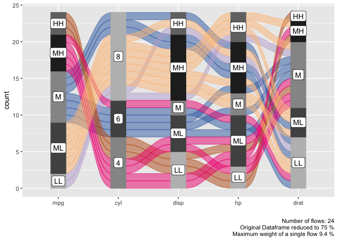
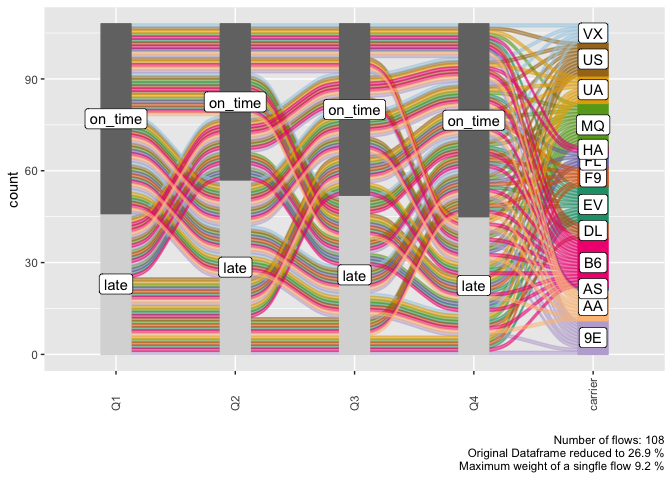
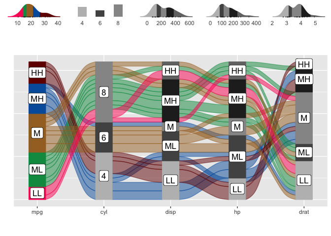
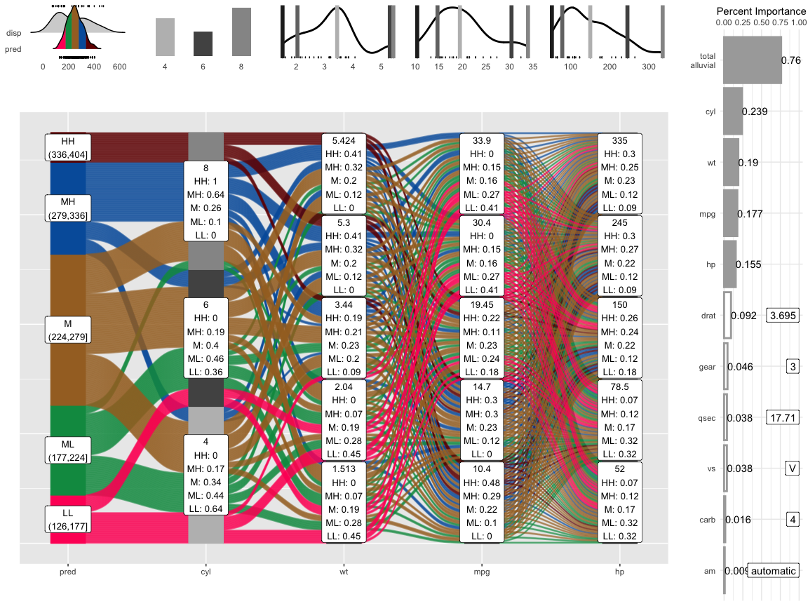

<!-- README.md is generated from README.Rmd. Please edit that file -->

# easyalluvial <a href='https://erblast.github.io/easyalluvial'></a>

[](https://travis-ci.org/erblast/easyalluvial)
[](https://ci.appveyor.com/project/erblast/easyalluvial)

[](https://codecov.io/github/erblast/easyalluvial?branch=master)
[](https://CRAN.R-project.org/package=easyalluvial)
[](https://CRAN.R-project.org/package=easyalluvial)
[](https://CRAN.R-project.org/package=easyalluvial)

Alluvial plots are similar to [sankey
diagrams](https://en.wikipedia.org/wiki/Sankey_diagram) and visualise
categorical data over multiple dimensions as flows. [Rosval et.
al. 2010](https://journals.plos.org/plosone/article?id=10.1371/journal.pone.0008694)
Their graphical grammar however is a bit more complex then that of a
regular x/y plots. The
[`ggalluvial`](http://corybrunson.github.io/ggalluvial/) package made a
great job of translating that grammar into
[`ggplot2`](https://github.com/tidyverse/ggplot2) syntax and gives you
many option to tweak the appearance of an alluvial plot, however there
still remains a multi-layered complexity that makes it difficult to use
‘ggalluvial’ for explorative data analysis. ‘easyalluvial’ provides a
simple interface to this package that allows you to produce a decent
alluvial plot from any dataframe in either long or wide format from a
single line of code while also handling continuous data. It is meant to
allow a quick visualisation of entire dataframes with a focus on
different colouring options that can make alluvial plots a great tool
for data exploration.

## Features

  - plot alluvial graph with a single line of code of a given dataframe
  - support for wide and long data format [(wiki, wide vs. long/narrow
    data)](https://en.wikipedia.org/wiki/Wide_and_narrow_data)
  - automatically transforms numerical to categorical data
  - helper functions for variable selection
  - convenient parameters for coloring and ordering
  - marginal histograms
  - **model agnostic partial dependence and model response alluvial
    plots with 4 dimensions**
  - **[interactive plots with `easyalluvial` and
    `parcats`](https://erblast.github.io/parcats/articles/parcats.html)**

## Installation

### CRAN

``` r
install.packages('easyalluvial')
```

### Development Version

``` r

# install.packages("devtools")
devtools::install_github("erblast/easyalluvial")
```

## Documentation

  - [pkgdown website](https://erblast.github.io/easyalluvial/)
      - [Data Exploration with Alluvial
        Plots](https://erblast.github.io/easyalluvial/articles/data_exploration.html)
      - [Visualising Model
        Response](https://erblast.github.io/easyalluvial/articles/model_response.html)
      - [Interactive Plots with
        parcats](https://erblast.github.io/easyalluvial/articles/parcats.html)

## Examples

``` r
suppressPackageStartupMessages( require(tidyverse) )
suppressPackageStartupMessages( require(easyalluvial) )
```

### Alluvial from data in wide format

#### Sample Data

``` r

knitr::kable( head(mtcars2) )
```

|  mpg | cyl | disp |  hp | drat |    wt |  qsec | vs | am        | gear | carb | ids               |
| ---: | :-- | ---: | --: | ---: | ----: | ----: | :- | :-------- | :--- | :--- | :---------------- |
| 21.0 | 6   |  160 | 110 | 3.90 | 2.620 | 16.46 | V  | manual    | 4    | 4    | Mazda RX4         |
| 21.0 | 6   |  160 | 110 | 3.90 | 2.875 | 17.02 | V  | manual    | 4    | 4    | Mazda RX4 Wag     |
| 22.8 | 4   |  108 |  93 | 3.85 | 2.320 | 18.61 | S  | manual    | 4    | 1    | Datsun 710        |
| 21.4 | 6   |  258 | 110 | 3.08 | 3.215 | 19.44 | S  | automatic | 3    | 1    | Hornet 4 Drive    |
| 18.7 | 8   |  360 | 175 | 3.15 | 3.440 | 17.02 | V  | automatic | 3    | 2    | Hornet Sportabout |
| 18.1 | 6   |  225 | 105 | 2.76 | 3.460 | 20.22 | S  | automatic | 3    | 1    | Valiant           |

#### Plot

Continuous Variables will be automatically binned as follows.

  - High, High (HH)
  - Medium, High (MH)
  - Medium (M)
  - Medium, Low (ML)
  - Low, Low (LL)

<!-- end list -->

``` r

alluvial_wide( data = mtcars2
                , max_variables = 5
                , fill_by = 'first_variable' )
```

<!-- -->

### Alluvial from data in long format

#### Sample Data

``` r
knitr::kable( head(quarterly_flights) )
```

| tailnum           | carrier | origin | dest | qu | mean\_arr\_delay |
| :---------------- | :------ | :----- | :--- | :- | :--------------- |
| N0EGMQ LGA BNA MQ | MQ      | LGA    | BNA  | Q1 | on\_time         |
| N0EGMQ LGA BNA MQ | MQ      | LGA    | BNA  | Q2 | on\_time         |
| N0EGMQ LGA BNA MQ | MQ      | LGA    | BNA  | Q3 | on\_time         |
| N0EGMQ LGA BNA MQ | MQ      | LGA    | BNA  | Q4 | on\_time         |
| N11150 EWR MCI EV | EV      | EWR    | MCI  | Q1 | late             |
| N11150 EWR MCI EV | EV      | EWR    | MCI  | Q2 | late             |

#### Plot

``` r

alluvial_long( quarterly_flights
               , key = qu
               , value = mean_arr_delay
               , id = tailnum
               , fill = carrier )
```

<!-- -->

### Marginal Histograms

``` r
alluvial_wide( data = mtcars2
                , max_variables = 5
                , fill_by = 'first_variable' ) %>%
  add_marginal_histograms(mtcars2)
```

<!-- -->

### Interactive Graphs

``` r

suppressPackageStartupMessages( require(parcats) )

p = alluvial_wide(mtcars2, max_variables = 5)

parcats(p, marginal_histograms = TRUE, data_input = mtcars2)
```


  - **[Live
    Widget](https://erblast.github.io/parcats/articles/parcats.html)**

### Partial Dependence Alluvial Plots

Alluvial plots are capable of displaying higher dimensional data on a
plane, thus lend themselves to plot the response of a statistical model
to changes in the input data across multiple dimensions. The practical
limit here is 4 dimensions while conventional partial dependence plots
are limited to 2 dimensions.

Briefly the 4 variables with the highest feature importance for a given
model are selected and 5 values spread over the variable range are
selected for each. Then a grid of all possible combinations is created.
All none-plotted variables are set to the values found in the first row
of the training data set. Using this artificial data space model
predictions are being generated. This process is then repeated for each
row in the training data set and the overall model response is averaged
in the end. Each of the possible combinations is plotted as a flow which
is coloured by the bin corresponding to the average model response
generated by that particular combination.

  - [more on partial dependence plots
    (ebook)](https://christophm.github.io/interpretable-ml-book/)
  - [Tutorial](https://www.datisticsblog.com/2019/04/visualising-model-response-with-easyalluvial/)

<!-- end list -->

``` r

df = select(mtcars2, -ids)
m = randomForest::randomForest( disp ~ ., df)
imp = m$importance

dspace = get_data_space(df, imp, degree = 4)

pred = get_pdp_predictions(df, imp
                           , m
                           , degree = 4
                           , bins = 5)


p = alluvial_model_response(pred, dspace, imp
                            , degree = 4, method = 'pdp'
                            , stratum_label_size = 2.75)

p_grid = add_marginal_histograms(p, df, plot = F) %>%
  add_imp_plot(p, df)
```

<!-- -->

### Interactive Partial Dependence Plot

``` r
df = select(mtcars2, -ids )
m = randomForest::randomForest( disp ~ ., df)
imp = m$importance
dspace = get_data_space(df, imp, degree = 3)
pred = predict(m, newdata = dspace)
p = alluvial_model_response(pred, dspace, imp, degree = 3)

parcats(p, marginal_histograms = TRUE, imp = TRUE, data_input = df)
```


- **[Live
Widget](https://erblast.github.io/parcats/articles/parcats.html)**
