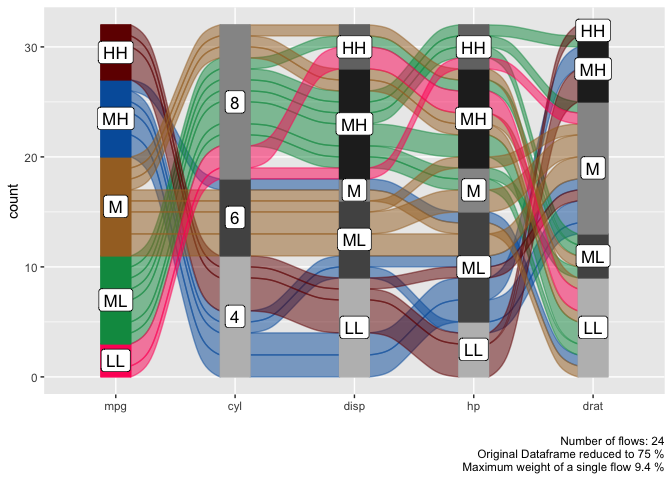

<!-- README.md is generated from README.Rmd. Please edit that file -->
# easyalluvial  

[](https://travis-ci.org/erblast/easyalluvial) [](https://ci.appveyor.com/project/erblast/easyalluvial) 
[](https://codecov.io/github/erblast/easyalluvial?branch=master)
[](https://CRAN.R-project.org/package=easyalluvial)
[](https://CRAN.R-project.org/package=easyalluvial)


Alluvial plots are similar to [sankey diagrams](https://en.wikipedia.org/wiki/Sankey_diagram) and visualise categorical data over multiple dimensions as flows. [Rosval et. al. 2010](https://journals.plos.org/plosone/article?id=10.1371/journal.pone.0008694) Their graphical grammar however is a bit more complex then that of a regular x/y plots. The [`ggalluvial`](http://corybrunson.github.io/ggalluvial/) package made a great job of translating that grammar into [`ggplot2`](https://github.com/tidyverse/ggplot2) syntax and gives you many option to tweak the appearance of an alluvial plot, however there still remains a multi-layered complexity that makes it difficult to use 'ggalluvial' for explorative data analysis. 'easyalluvial' provides a simple interface to this package that allows you to produce a decent alluvial plot from any dataframe in either long or wide format from a single line of code while also handling continuous data. It is meant to allow a quick visualisation of entire dataframes with a focus on different colouring options that can make alluvial plots a great tool for data exploration.

Features
--------

-   plot alluvial graph with a single line of code of a given dataframe
-   support for wide and long data format [(wiki, wide vs. long/narrow data)](https://en.wikipedia.org/wiki/Wide_and_narrow_data)
-   automatically transforms numerical to categorical data
-   helper functions for variable selection
-   convenient parameters for coloring and ordering

Installation
------------

### CRAN

``` r
install.packages('easyalluvial')
```

### Development Version

``` r
devtools::install_github("erblast/easyalluvial")
```

Tutorials
---------

In order to learn about all the features an how they can be useful check out the following tutorials:

-   [Data exploration with alluvial plots](https://www.datisticsblog.com/2018/10/intro_easyalluvial/#features)

Examples
--------

### Alluvial from data in wide format

#### Prepare sample data

``` r

suppressPackageStartupMessages( require(tidyverse) )
suppressPackageStartupMessages( require(easyalluvial) )

data = as_tibble(mtcars)
categoricals = c('cyl', 'vs', 'am', 'gear', 'carb')
numericals = c('mpg', 'cyl', 'disp', 'hp', 'drat', 'wt', 'qsec')

data = data %>%
  mutate_at( vars(categoricals), as.factor )
```

#### Plot

Continuous Variables will be automatically binned as follows.

-   High, High (HH)
-   Medium, High (MH)
-   Medium (M)
-   Medium, Low (ML)
-   Low, Low (LL)

``` r

alluvial_wide( data = data
                , max_variables = 5
                , fill_by = 'first_variable' )
```



### Alluvial from data in long format

#### Sample Data

``` r

knitr::kable( head(quarterly_flights) )
```

| tailnum           | carrier | origin | dest | qu  | mean\_arr\_delay |
|:------------------|:--------|:-------|:-----|:----|:-----------------|
| N0EGMQ LGA BNA MQ | MQ      | LGA    | BNA  | Q1  | on\_time         |
| N0EGMQ LGA BNA MQ | MQ      | LGA    | BNA  | Q2  | on\_time         |
| N0EGMQ LGA BNA MQ | MQ      | LGA    | BNA  | Q3  | on\_time         |
| N0EGMQ LGA BNA MQ | MQ      | LGA    | BNA  | Q4  | on\_time         |
| N11150 EWR MCI EV | EV      | EWR    | MCI  | Q1  | late             |
| N11150 EWR MCI EV | EV      | EWR    | MCI  | Q2  | late             |

#### Plot

``` r

alluvial_long( quarterly_flights
               , key = qu
               , value = mean_arr_delay
               , id = tailnum
               , fill = carrier )
```


